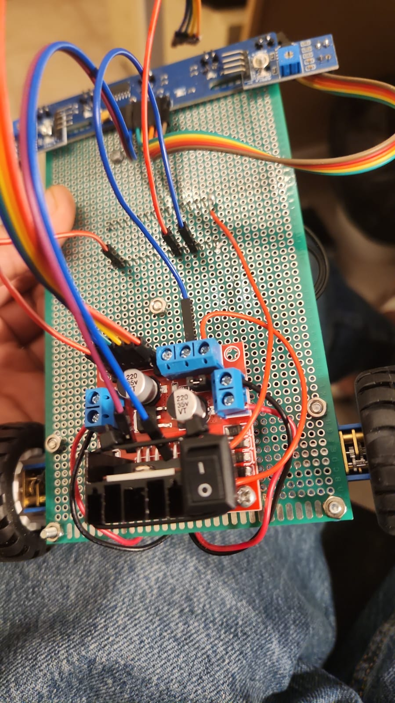
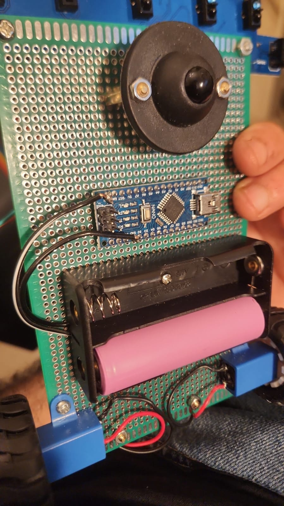

# PID Line Follower

**An Arduino Nano robot that follows a black line using five analog reflectance sensors and differential motor control.**

[Build & upload](#build--upload) · [Wiring](docs/HARDWARE.md) · [Control & tuning](docs/CONTROL.md) · [Track demonstration](media/track-demo.mp4)

<p align="center">
  
  
</p>

| Controller | Sensing | Firmware | Dependency |
| --- | --- | --- | --- |
| Arduino Nano / ATmega328P | 5 analog QTR channels | Arduino C++ | Pololu QTRSensors 4.0.0 |

## Project overview

The robot estimates the line position, computes a steering correction, and drives the two motors independently. The project demonstrates sensor calibration, feedback control, PWM motor control, and handling of missing or ambiguous sensor readings.

The controller has proportional, integral, and derivative terms. **The supplied tuning uses PD control: the integral gain is zero.** The project does not include measured speed, lap-time, or accuracy benchmarks.

## Firmware status

The photos and video show the original physical project. The maintained firmware passes controller regression tests and builds with PlatformIO for the Nano, but its updated recovery behavior **still requires a track test on the robot**.

The original uploaded firmware is preserved at [`legacy/line_follower_original.ino`](legacy/line_follower_original.ino). The active sketch is [`firmware/LineFollower/LineFollower.ino`](firmware/LineFollower/LineFollower.ino).

## What the maintained firmware does

- Calibrates all five sensors over 400 sampling iterations at startup.
- Reads a calibrated line position between 0 and 4000, with a center target of 2000.
- Applies a differential PD correction and limits motor output to ±210 PWM.
- Uses a threshold on the calibrated 0–1000 sensor scale.
- Remembers the last observed side of the line for a slow recovery turn.
- Stops after 750 ms without reacquiring the line, or immediately if no search direction is known.
- Resumes tracking when the line reappears, without a derivative spike from the recovery interval.

## Build & upload

### Arduino IDE

1. Install **QTRSensors by Pololu**, version **4.0.0**, from Library Manager.
2. Open `firmware/LineFollower/LineFollower.ino`.
3. Select **Arduino Nano** and the processor/bootloader matching your board.
4. Check the [wiring reference](docs/HARDWARE.md), then upload through USB.

### PlatformIO

```bash
git clone https://github.com/dilen1997/High-Performance-PID-Line-Follower.git
cd High-Performance-PID-Line-Follower
pio run -e nanoatmega328
pio run -e nanoatmega328 --target upload
```

The configuration pins the AVR platform and sensor-library versions. A Nano clone may need a different bootloader/upload setting; that setting does not change the control algorithm.

## Startup and first run

1. Raise the wheels and power on the robot.
2. While the built-in LED is lit, manually sweep **each** sensor across both black and white surfaces.
3. When the LED turns off, a one-second delay precedes control. Calibration duration depends on sampling; it is not a fixed ten-second timer.
4. Confirm that a positive command drives each motor forward, and that a line on the left produces a left turn.
5. Begin at a reduced `kBaseSpeed` in `Control.h`, then tune on the real track.

See the [hardware acceptance steps](docs/HARDWARE.md#hardware-acceptance) before using the maintained revision at the original cruising setting.

## Control settings

| Parameter | Supplied value | Meaning |
| --- | ---: | --- |
| `kKp` | 0.363 | Position-error correction |
| `kKi` | 0.0 | Integral disabled |
| `kKd` | 0.677 | Difference between consecutive errors |
| `kBaseSpeed` | 190 | Nominal PWM, not a measured velocity |
| `kMaxSpeed` | 210 | Absolute motor PWM limit |
| `kRecoverySpeed` | 65 | Recovery-turn PWM |
| `kRecoveryTimeoutMs` | 750 | Maximum continuous search interval |

The gains preserve the original code's division by ten. The controller uses per-loop error differences, not a fixed-time derivative; changing sampling rate can change the tuning.

## Repository guide

| Path | Purpose |
| --- | --- |
| `firmware/LineFollower/` | Active Arduino sketch and host-testable controller |
| `legacy/` | Unmodified original firmware |
| `media/` | Original photos and one canonical demonstration video |
| `docs/` | Pin reference, calibration, control design, and verification limits |
| `tests/` | Tracking, recovery, timeout, and timer-rollover regression checks |

Run the controller tests on a computer with a C++11 compiler:

```bash
g++ -std=c++11 -Wall -Wextra -Werror -Ifirmware/LineFollower tests/test_control.cpp -o test_control
./test_control
```

## Author & license

**Dilen Guerchon** · Electrical & Electronics Engineering student, Ruppin Academic Center
[Engineering portfolio](https://github.com/dilen1997/Smart-Charge-Manager/blob/main/docs/PORTFOLIO.md) · [MIT license](LICENSE)
